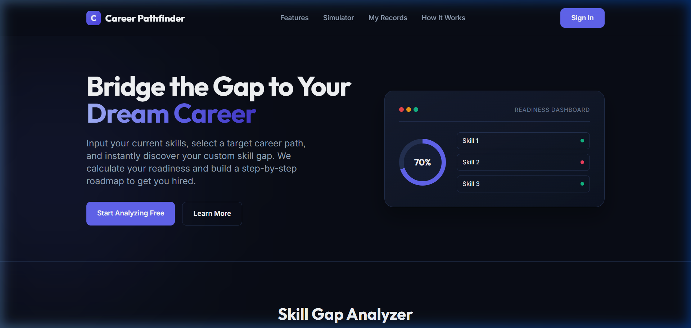
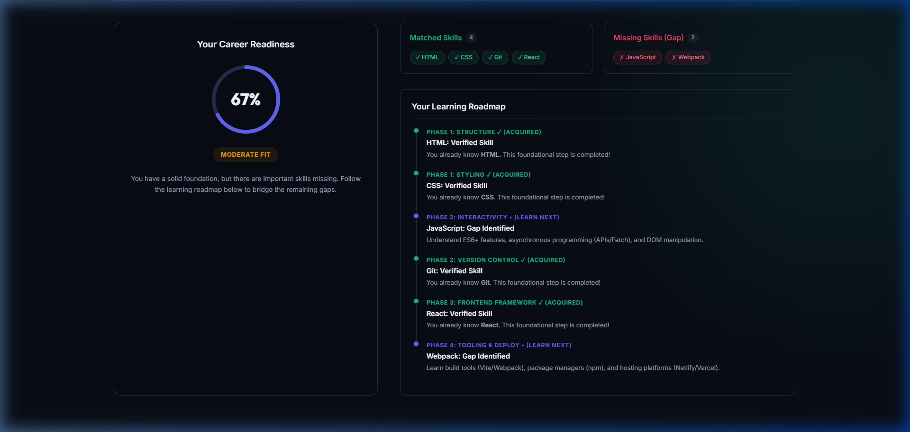

# 🚀 Career Pathfinder: Career Skill Gap Analyzer 🎯

Welcome to **Career Pathfinder** — a sleek, modern, dark-themed web application built to help developers, students, and professionals bridge the gap between their current skills and their dream career roles. 

By analyzing your current technical skillset against standard industry requirements, Career Pathfinder calculates a real-time **Readiness Score**, identifies **Skill Gaps**, and generates a **personalized, step-by-step phased roadmap** to guide your learning journey.

---

## 📸 App Screenshots

### 🖥️ Dynamic Landing & Dashboard
Instantly check your readiness dashboard and navigate through the sleek, interactive interface.


### 📊 Real-time Skill Analysis & Learning Roadmap
Input your current skills and target role to view your readiness percentage, matching skills, identified gaps, and a step-by-step learning checklist.


---

## ✨ Features

- **⚡ Real-time Skill Gap Analysis:** Input your current technical skills (with autocomplete suggestions) and immediately discover where you stand.
- **🎯 16 Prepopulated Target Career Paths:** Pre-configured paths based on industry job posts and professional certifications:
  - 🌐 *Frontend Developer*
  - ⚙️ *Backend Developer*
  - 💻 *Full Stack Developer*
  - 📊 *Data Scientist*
  - 🛡️ *Cyber Security Analyst*
  - 🎯 *Product Manager*
  - 📱 *Mobile App Developer*
  - ♾️ *DevOps Engineer*
  - ☁️ *Cloud Architect*
  - 🎨 *UI/UX Designer*
  - 🔍 *QA Automation Engineer*
  - 🤖 *AI / ML Engineer*
  - 🗄️ *Data Engineer*
  - 🎮 *Game Developer*
  - 🖥️ *System Administrator*
  - ⛓️ *Blockchain Developer*
- **📈 Interactive Conic-Gradient Progress Circle:** Sleek visual indicators for career readiness scores:
  - **Career Ready (80%+):** Focus on portfolio building and applications.
  - **Moderate Fit (40%-79%):** Core foundation built; work on identified gaps.
  - **Aspiring (<40%):** Start from Phase 1 of the roadmap to learn core skills.
- **🗺️ Phased Learning Roadmap:** A structured checklist showing exactly what topics to study next.
- **🔐 User Authentication System:** Sign up or log in to save assessment history permanently.
- **📂 Historical Tracking & Records:** Manage, view, and clear your previous skill assessments.

---

## 📁 Directory Structure

```text
📂 Career_Skill_Gap_Analyzer/
├── 📂 static/
│   ├── 🖼️ landing_page.png       # Application Landing Page Screenshot
│   ├── 🖼️ analysis_results.png   # Interactive Assessment & Roadmap Screenshot
│   └── 📜 script.js              # Client-side dynamic UI logic & dropdown details
├── 📂 templates/
│   ├── 📄 auth.html              # Dark-theme authentication page (login & register)
│   ├── 📄 history.html           # Historical records page for tracked analyses
│   └── 📄 index.html             # Core landing page, simulator, and results display
├── ⚙️ app.py                    # Main Flask backend application (server, routing, gap algorithms)
├── 🗄️ careers.db                 # SQLite database storing users, career roadmaps, and check logs
├── 🛠️ init_db.py                # Database setup and seeder script for career parameters
└── 📝 README.md                  # Detailed documentation (this file)
```

---

## 🛠️ Technology Stack

- **Backend:** Python 🐍, Flask microframework
- **Database:** SQLite 🗄️ (with structured relational tables for users, careers, and roadmaps)
- **Frontend & Styling:** HTML5, Tailwind CSS CDN (with a custom dark-mode theme: `#090d16` background and Outfit/Inter typography), Vanilla JavaScript ES6+
- **Version Control:** Git

---

## 🚀 Getting Started

### 1️⃣ Clone the Repository
```bash
git clone https://github.com/KhushbooSuwalka/Career_Skill_Gap_Analyzer.git
cd Career_Skill_Gap_Analyzer
```

### 2️⃣ Install Dependencies
Ensure you have **Python 3.x** installed. Install Flask:
```bash
pip install Flask
```

### 3️⃣ Initialize the SQLite Database
Run the setup script to create the tables and seed them with the 16 career paths and roadmaps:
```bash
python init_db.py
```

### 4️⃣ Launch the Application
Start the Flask development server:
```bash
python app.py
```

Open your browser and navigate to **`http://127.0.0.1:5000`** to begin exploring!

---

## 👥 Contributors

- **Khushboo Suwalka** - *Lead Developer*
